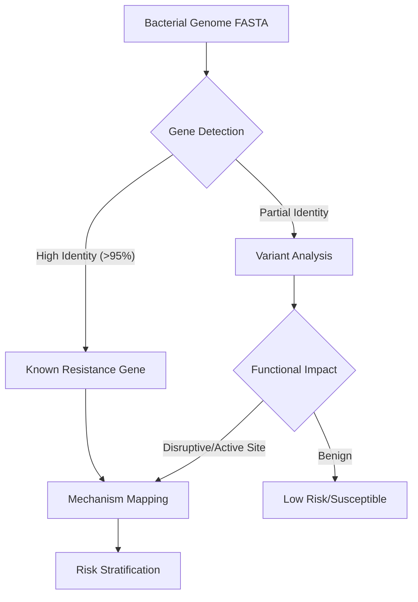

# ABRISK Biological Pipeline Logic

**Status**: Draft
**Phase**: 2 (Definition)

## 1. Pipeline Overview

The ABRISK pipeline transforms raw bacterial genomic data into an interpretable antibiotic risk profile. It moves beyond simple gene detection to mechanism-aware risk stratification.

## 2. Step-by-Step Logic

### Step 1: Resistance Gene Detection (The "Prior")
*   **Input**: Contigs or complete genome.
*   **Tool**: `Diamond` (blastx-like, speed-optimized).
*   **Reference DB**: CARD (primary), NDARO (secondary).
*   **Thresholds**:
    *   **Identity**: $\ge$ 95.0% (Strict mode to prevent hallucinations).
    *   **Coverage**: $\ge$ 90.0% of reference length.
*   **Logic**:
    *   If Match $\ge$ Thresholds $\rightarrow$ **Tag: KNOWN_RESISTANCE**.
    *   If Match < Thresholds but matches HMM profile $\rightarrow$ **Tag: PUTATIVE_VARIANT**.

### Step 2: Variant & Structural Analysis (The "Novelty")
*   **Input**: Putative variants (SNPs/Indels).
*   **Tool**: `ESM-2` (Embeddings) / `AlphaFold` (Structure - *Future*).
*   **Logic**:
    1.  Align variant to wild-type structure.
    2.  **Active Site Check**: Is the mutation within 5Å of the catalytic center or binding pocket?
        *   **Yes** $\rightarrow$ High likelihood of functional change.
    3.  **Stability Check**: Does the mutation destabilize the protein (e.g., hydrophobic core -> logic)?
*   **Output**: Functional Impact Score (0.0 - 1.0).

### Step 3: Mechanism Mapping & Risk Stratification
*   **Input**: Identified Genes + Functional Impact.
*   **Classification**:
    *   **Tier 1 (High Risk)**: Known resistant gene (e.g., *bla*NDM-1) OR Functional variant in active site.
    *   **Tier 2 (Moderate Risk)**: Unknown variant in known resistance family.
    *   **Tier 3 (Low Risk)**: No hits or benign variants.
*   **Contextualization (India)**:
    *   Adjust risk score based on local prevalence (ICMR data).
    *   *Example*: *bla*OXA-48 is endemic in certain Indian regions; its presence is a high-confidence stopping criterion for Carbapenems.

## 3. Explanations
Every output must generate a natural language explanation:
*   *"Detected NDM-1 with 100% identity. This is a Metallo-beta-lactamase that confers resistance to nearly all beta-lactams including Carbapenems."*
*   *"Detected variant of likely beta-lactamase (85% identity). Mutation T245A is in the active site region (distance < 4Å), suggesting preserved or enhanced catalytic activity."*
